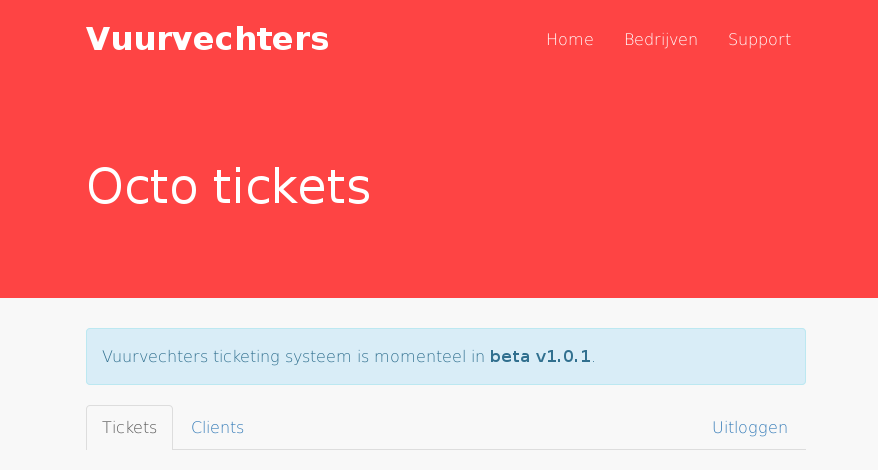

# Octo-waffle

Octo-waffle is the collection name for the vuurvechters.nl homepage and ticketing system.
The server runs on port 3000.

## Requirements
* Redis server
* ^ Node 0.12.1

## Installing and running in production
```
npm install --production
export NODE_ENV=production
pm2 start app.js || forever start app.js
```

## Developing octo-waffle
Running octo-waffle:
```
npm install
gulp
```
